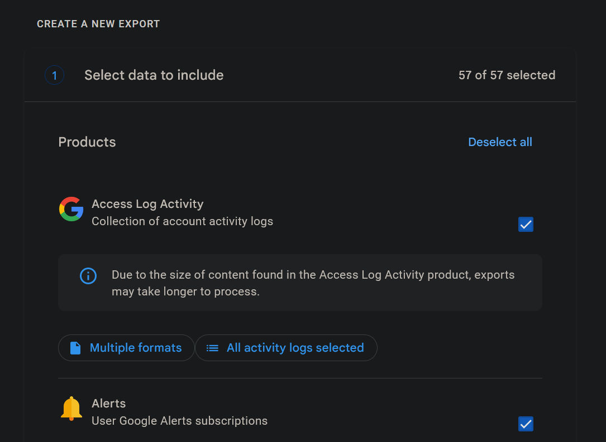
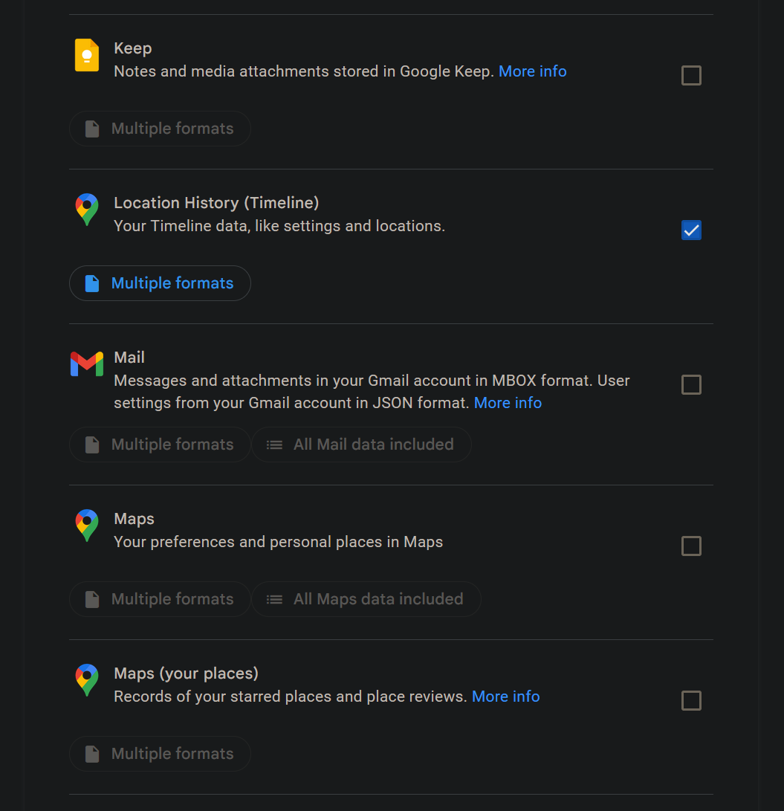
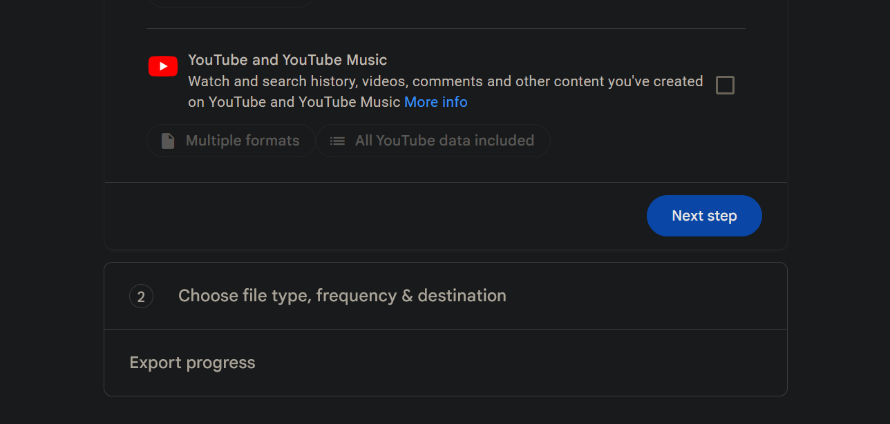
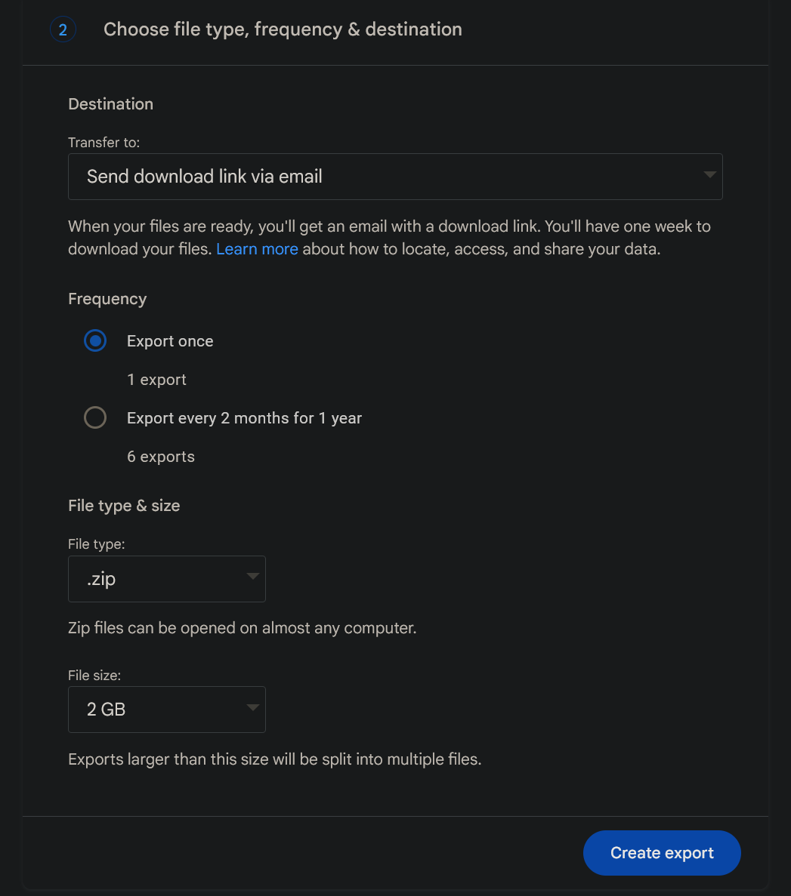

# takeout-travel-history
Reads your Google Takeout data from maps to generate a list of each time you changed countries

# Usage

This program is designed to work with Google Takout data from Google Maps Timeline.

To get your Timeline data, navigate to https://takeout.google.com/settings/takeout/

By default, all your data is selected for export; you can use the "Deselect all" button to ignore the data

Then, scroll down and select "Location History (Timeline)" for export

Select "Next step" to proceed

Select your export options; ensure "`.zip`" is selected as the file type

Then, retrieve your `.zip` file and point this tool at it using the `-p` option. You can also extract the `Records.json` from the file and supply that path instead.

